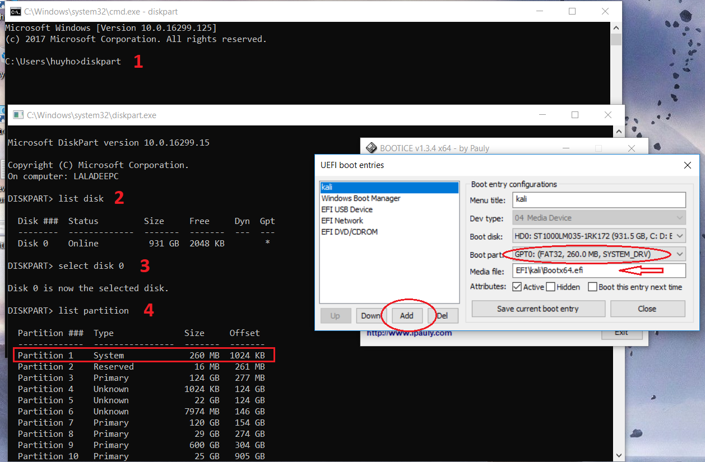

+++
title = "Operating System"
date = "2017-12-31"
categories = [
    "OS",
]

+++
## Lost grub

Some reasons:

* Upgrade BIOS
* Reinstall windows while using dual OS
* Grub not installed in Linux installation progress

### Re-install grub

1. Re-install grub bootloader

   Use [boot-repair-disk](https://sourceforge.net/projects/boot-repair-cd/) as a rescue tool if can't boot into linux os, setup into the USB and boot it up

   ```bash
   grub-install /dev/sda
   update-grub
   ```

   Check the disk with `fdisk -l` or `blkid`

2. Use BOOTICE

   UEFI uses `efi` files in EFI partition to boot the OS, as Windows is `bootmgfw.efi`, Kali Linux is `grubx64.efi`,... Now setup a boot entry on the top of order. Go to `UEFI` tab >  `Edit boot entries`

   Add a new one with:

   * Menu title: `any`
   * Boot disk: `primary disk`
   * Boot part: `EFI SYSTEM partition`
   * Media file: `EFI file (default of Kali is EFI\kali\grubx64.efi)`

   


​		Check the EFI partition with `Disk Management` or `Diskpart > list disk > select disk 0 > list partition/list volume`
